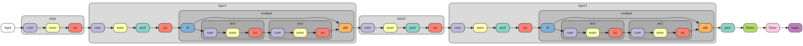

# DSA4212

## Assignment 1

### Objective
Image classification from 10 classes (fish, dog, device, chainsaw, church, horn, truck, petrol, golf, parachute). Very similar to CIFAR-10 but different set of classes.

### Constraints
1. Start with a randomized neural network (not allowed to use pre-trained model)
2. Time limit to train is 120 seconds, excluding data preprocessing and model evaluation
3. Test set cannot be used during training

## Assignment 2

### Objective
TBC.

### Constraints
TBC.