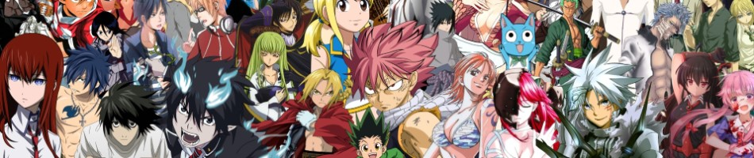
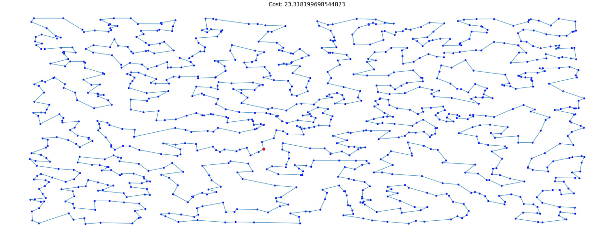

# DSA4212

## Assignment 1

### Objective
Image classification from 10 classes (fish, dog, device, chainsaw, church, horn, truck, petrol, golf, parachute). Very similar to CIFAR-10 but different set of classes.

### Constraints
1. Start with a randomized neural network (not allowed to use pre-trained model)
2. Time limit to train is 120 seconds, excluding data preprocessing and model evaluation
3. Test set cannot be used during training

## Assignment 2

### Objective
Recommendation system for animes given user preferences. Similar problems available on Kaggle.

### Constraints
1. Start with a non-factor model approach
2. Check if factor model approaches or other methods discuss in class can help improve the system
3. Optionally improve the recommendation system by all means possible

### Remark
The data can be obtained from [Kaggle](https://www.kaggle.com/datasets/CooperUnion/anime-recommendations-database).

## Assignment 3

### Objective
Given `cities.npy` as a TSP instance, find the optimum tour.

### Constraints
None.
